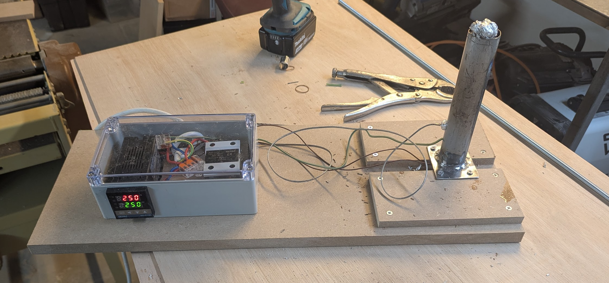

# Tasks

## Drawing

using freecad. PDF A3 scale 1 [here](./ukulele-A3_drawing.pdf)

## Bending iron

see https://www.youtube.com/watch?v=Oxe-JnyoJ4c

##  Body

* [ ] create drawing
* [x] mold

* [x] glue-up top (glue up first because halves don't align perfectly - slightly warped)
* [x] glue-up bottom (...)

* [x] thickness plane top to 0.4mm too thick (final thickness 2-2.3mm)
* [x] thickness plane bottom to 0.4mm too thick (final thickness 2-2.3mm)

* [ ] thickness plane top and bottom to remove glue seam

* [ ] draw top and bottom
* [ ] cut hole in top
* [ ] inlay in top

* [ ] cut top to slightly oversize leaving a tab on the top and bottom for clamping
* [ ] cut bottom to slightly oversize leaving a tab on the top and bottom for clamping

* [ ] reinforce (bracing) top. wood: Sitka spruce
* [ ] reinforce (bracing) bottom. wood: Sitka spruce

* [x] create paper template for folding sidewalls with main bend lines (and proper length) using the mold
* [x] jointing plane sidewall
* [x] thickness plane sidewalls to 0.1mm too thick (just enough left for sanding). final thickness 1.7-2mm
* [x] cut sidewalls to width (66mm)
* [x] bend sidewalls
* [x] clamp sidewalls in mold

* [ ] create and fit head block
* [ ] create and fit tail block

* [ ] create kerfing top and bottom
* [ ] glue kerfing top and bottom in place

* [ ] glue top and bottom to sidewalls
* [ ] trim top and back using router
* [ ] sand sidewalls using sanding drum attached to drill

* [ ] trim to allow for binding and purfling
* [ ] add binding strip
* [ ] add purfling strip

## Fretboard

# references

* https://www.youtube.com/watch?v=nU_pkSx9Aes
* [Oaktown ukulele plans](https://www.oaktownstrings.com/free-instrument-plans)
* [Oaktown ukulele instructions](https://www.oaktownstrings.com/construction)

# shopping list

* binding strip
* purfling strip